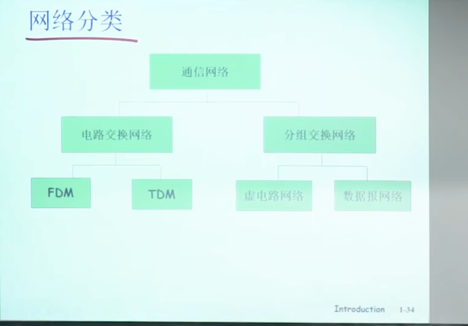
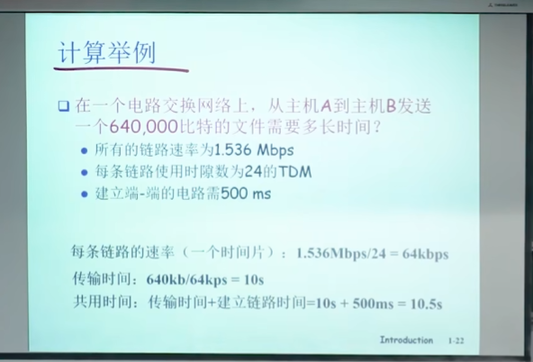
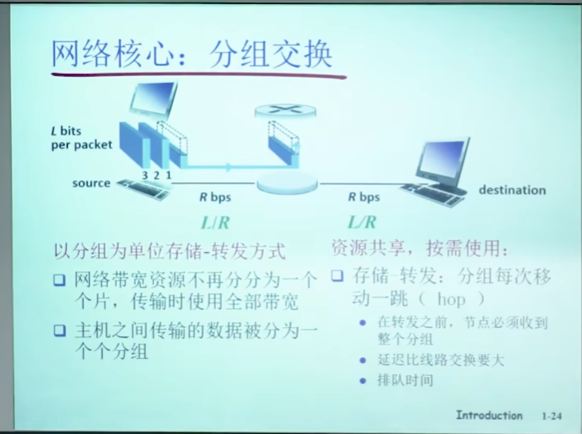

# 第一章
## 网络核心

_网络分类_

### 电路交换

_电路交换的计算举例_

#### 电路交换不适合计算机之间的通信
- 连接建立时间长
- 计算机之间的通信由突发性，如果使用线路交换，则浪费的片较多
    - 即使这个呼叫没有数据传递，其所占据的片也不能被别的呼叫使用
- 可靠性不高

### 分组交换

#### 特点

#### 排队延迟和丢失

##### 排队和延迟：

- 如果到达速率>链路的输出速率：
  - 分组将会排队，等待传输。
  - 如果路由器的缓存用完了，分组将会被抛弃。

#### 网络核心的关键功能
- 路由：决定分组采用的源到目标的路径
  - 路由算法
- 转发：将分组从路由器的输入链路转移到输出链路

#### 存储和转发 
_分组交换：分组的存储转发一段一段从远端传到目标端，按照有无网络层的连接，分成数据报网络和虚电路网络_

##### 数据报网络
- 分组的目标地址决定下一路
- 在通信之前，无需建立起一个连接，有数据就传输
- 路由器根据分组的目标地址进行路由
- 每一个分组都独立路由(路径不一样，可能会失序)

##### 虚电路网络
- 每个分组都带标签，

## 接入网和物理媒体
## Internet结构和ISP
